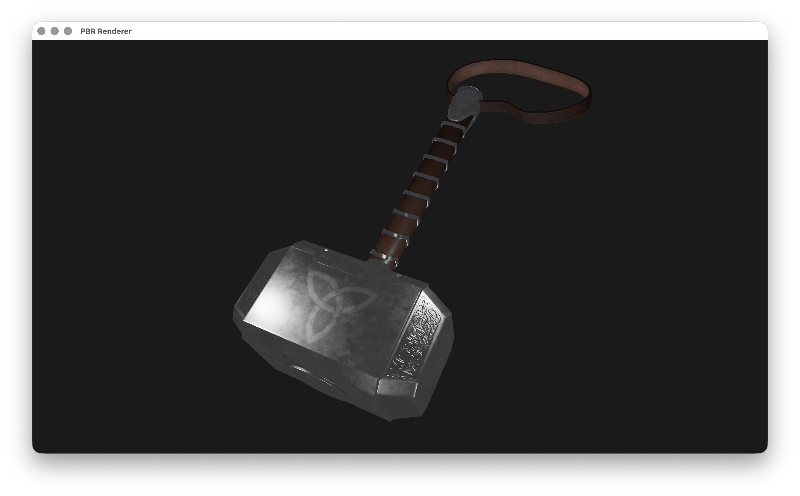
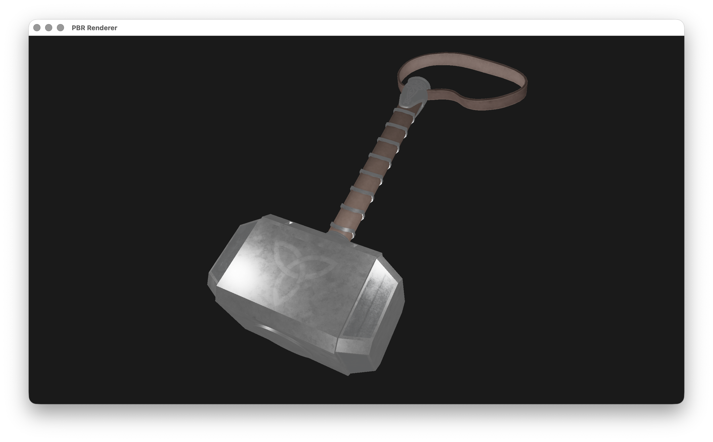
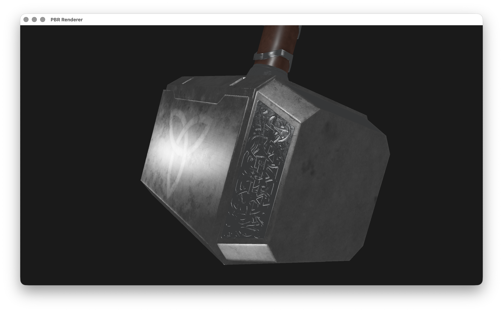
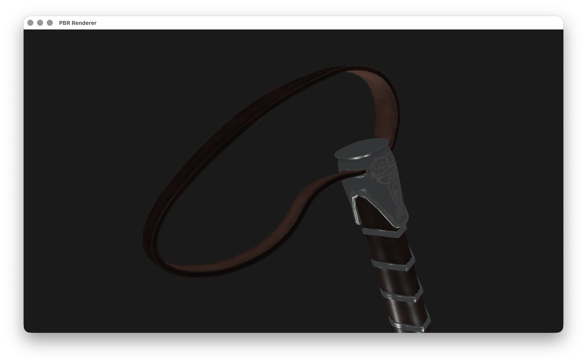
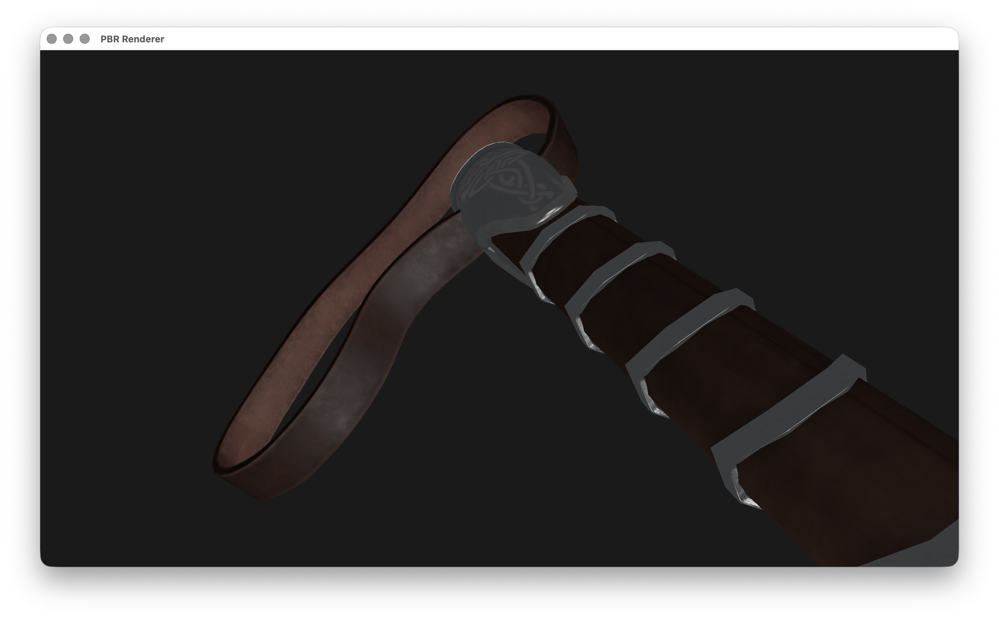

# Physically Based Rendering (PBR) 프로젝트

Cook-Torrance 기반의 사실적인 조명을 사용하는 PBR 렌더링 시스템입니다.

## 개요

이 프로젝트는 물리 기반 렌더링(Physically Based Rendering)을 구현한 3D 렌더러입니다. Cook-Torrance BRDF 모델을 사용하여 사실적인 조명과 재질 표현을 제공합니다.

## 스크린샷

### 최종 결과


### 기능별 비교

#### 모든 기능 OFF


#### Tangent Space ON


#### IBL (Image Based Lighting) ON


#### Albedo sRGB ON


### 디테일 뷰




## 주요 기능

### 렌더링 기능
- **Cook-Torrance BRDF**: 물리 기반 반사 모델 구현
  - Normal Distribution Function (GGX/Trowbridge-Reitz)
  - Geometry Function (Schlick-GGX, Smith)
  - Fresnel-Schlick 근사
- **Image Based Lighting (IBL)**: 환경 맵 기반 조명 지원
- **Tangent Space Normal Mapping**: 고품질 노말 매핑
- **HDR Tone Mapping**: 고동적 범위 톤 매핑
- **Gamma Correction**: 선형 색공간 처리

### Material 시스템
- **PBR Material 맵 지원**:
  - Albedo (Diffuse) Map - 기본 색상
  - Normal Map - 표면 디테일
  - Metallic Map - 금속성 (없으면 Specular 사용)
  - Roughness Map - 거칠기 (없으면 Shininess 반전 사용)
  - AO (Ambient Occlusion) Map - 앰비언트 오클루전
- **sRGB/Linear 색공간 변환**: Albedo 텍스처의 색공간 처리
- **자동 텍스처 로딩**: Material에 텍스처가 없을 때 기본 PBR 텍스처 자동 로드

### 모델 로딩
- **Assimp 기반**: 다양한 3D 모델 포맷 지원 (OBJ, FBX, 3DS 등)
- **Tangent Space 자동 감지**: 탄젠트/비탄젠트 데이터 자동 처리
- **다중 메시 지원**: 복잡한 모델 구조 처리

### 조명 시스템
- **다중 점 조명**: 최대 4개의 점 조명 지원
- **물리 기반 조명 계산**: 거리 기반 감쇠
- **IBL 환경 조명**: 이미지 기반 환경 조명

## 요구사항

### 필수 라이브러리
- OpenGL 3.3 이상
- GLFW3
- GLAD
- GLM (OpenGL Mathematics)
- Assimp (모델 로딩)
- stb_image (이미지 로딩)

## 빌드 방법

### 1. 필요한 라이브러리 설치

**macOS:**
```bash
brew install glfw assimp glm
```

**Linux (Ubuntu/Debian):**
```bash
sudo apt-get install libglfw3-dev libassimp-dev libglm-dev
```

**Windows:**
- vcpkg 또는 각 라이브러리를 수동으로 설치

### 2. GLAD 설정

- https://glad.dav1d.de/ 에서 OpenGL 3.3 Core 프로파일로 GLAD 생성
- 생성된 파일을 `include/glad/` 및 `include/KHR/` 디렉토리에 배치
- `src/glad.c` 파일도 포함

### 3. stb_image.h 설정

- https://github.com/nothings/stb 에서 `stb_image.h` 다운로드
- `include/stb_image.h`에 배치

### 4. 빌드

**빌드 스크립트 사용 (권장):**
```bash
# macOS/Linux
./build.sh

# Windows
build.bat
```

**깨끗한 빌드 (모든 파일 삭제 후 재빌드):**
```bash
./build_clean.sh
```

**수동 빌드:**
```bash
mkdir build
cd build
cmake ..
make
```

## 실행

**실행 스크립트 사용:**
```bash
# macOS/Linux
./run.sh
```

**또는 직접 실행:**
```bash
./build/PBR_Renderer
```

## 키보드 컨트롤

### 카메라 제어
- `W` / `A` / `S` / `D`: 카메라 전/좌/후/우 이동
- `마우스 이동`: 시점 변경
- `마우스 휠`: 줌 인/아웃
- `ESC`: 프로그램 종료

### 렌더링 모드 토글
- `V`: Tangent Space 모드 토글
  - ON: Tangent Space Normal Mapping 사용 (고품질)
  - OFF: World Space Normal 사용
- `B`: IBL (Image Based Lighting) 모드 토글
  - ON: 환경 맵 기반 조명 사용
  - OFF: 점 조명만 사용
- `N`: Albedo sRGB 모드 토글
  - ON: Albedo 텍스처를 sRGB에서 선형으로 변환
  - OFF: Albedo 텍스처를 선형 공간으로 가정
- `0`: 마우스 커서 잠금/해제
  - 잠금: 마우스로 카메라 회전 가능
  - 해제: 마우스 커서가 윈도우 밖으로 이동 가능

프로그램 시작 시 콘솔에 키 매핑 안내가 표시되며, 각 키를 누를 때마다 현재 상태가 콘솔에 출력됩니다.

## 프로젝트 구조

```
proj03_v3/
├── CMakeLists.txt          # 빌드 설정
├── build.sh                # 빌드 스크립트
├── build_clean.sh          # 깨끗한 빌드 스크립트
├── run.sh                  # 실행 스크립트
├── shader.vert             # Vertex Shader
├── shader.frag             # Fragment Shader (PBR)
├── src/
│   ├── main.cpp            # 메인 렌더링 루프
│   ├── model.cpp           # 모델 로더 (Assimp)
│   ├── mesh.cpp            # 메시 렌더링
│   ├── shader.cpp          # 셰이더 관리
│   └── camera.cpp          # 카메라 제어
├── include/
│   ├── model.h
│   ├── mesh.h
│   ├── shader.h
│   ├── camera.h
│   └── stb_image.h
├── Pbr/                    # PBR 텍스처 맵
│   ├── mjolnir3_lp_GreyMetal_BaseColor.png
│   ├── mjolnir3_lp_GreyMetal_Normal.png
│   ├── mjolnir3_lp_GreyMetal_Metallic.png
│   ├── mjolnir3_lp_GreyMetal_Roughness.png
│   └── mjolnir3_lp_GreyMetal_Height.png
├── Docs/                   # 스크린샷 및 문서
│   ├── 최종.png
│   ├── all_off.png
│   ├── Tangent Space on.png
│   ├── IBL on.png
│   ├── Albedo_sRGB on.png
│   ├── Detail1.png
│   ├── Detail2.png
│   └── Detail3.png
└── mjolnirFBX.FBX          # 3D 모델 파일
```

## 사용 예시

1. **프로그램 실행**
   ```bash
   ./run.sh
   ```

2. **Tangent Space 모드 전환**
   - `V` 키를 눌러 Tangent Space Normal Mapping 활성화/비활성화

3. **IBL 모드 전환**
   - `B` 키를 눌러 Image Based Lighting 활성화/비활성화
   - (IBL 텍스처가 준비된 경우)

4. **sRGB 변환 전환**
   - `N` 키를 눌러 Albedo 텍스처의 sRGB 변환 활성화/비활성화

5. **마우스 커서 제어**
   - `0` 키를 눌러 마우스 커서 잠금/해제

## 기술 세부사항

### Cook-Torrance BRDF
물리 기반 렌더링의 표준 모델로, 다음 세 가지 주요 구성 요소로 이루어져 있습니다:

1. **Normal Distribution Function (NDF)**: 미세면 분포
   - GGX/Trowbridge-Reitz 분포 사용

2. **Geometry Function**: 기하학적 가시성
   - Schlick-GGX 근사
   - Smith 방법으로 결합

3. **Fresnel Equation**: 프레넬 반사
   - Schlick 근사 사용

### 텍스처 처리
- 텍스처가 Material에 없을 경우 `Pbr/` 디렉토리에서 자동 검색
- 파일명 기반 자동 매칭 (BaseColor, Normal, Metallic, Roughness 등)
- 텍스처 중복 로드 방지 (캐싱)

## 참고 자료

- **LearnOpenGL PBR 튜토리얼**: https://learnopengl.com/PBR/Lighting
- **Cook-Torrance BRDF**: 물리 기반 렌더링의 표준 모델
- **Physically Based Rendering**: 현대 게임 및 영화 산업의 표준 렌더링 기법

## 라이선스

이 프로젝트는 교육 목적으로 제작되었습니다.

## 문제 해결

### 텍스처가 로드되지 않는 경우
- `Pbr/` 디렉토리에 필요한 텍스처 파일이 있는지 확인
- 콘솔 출력에서 텍스처 로딩 상태 확인

### 모델이 보이지 않는 경우
- 모델 파일 경로 확인
- 카메라 위치 조정 (WASD 키 사용)
- 조명 설정 확인

### 빌드 오류
- 모든 필수 라이브러리가 설치되었는지 확인
- GLAD와 stb_image.h가 올바른 위치에 있는지 확인
- `build_clean.sh`로 깨끗한 빌드 시도
